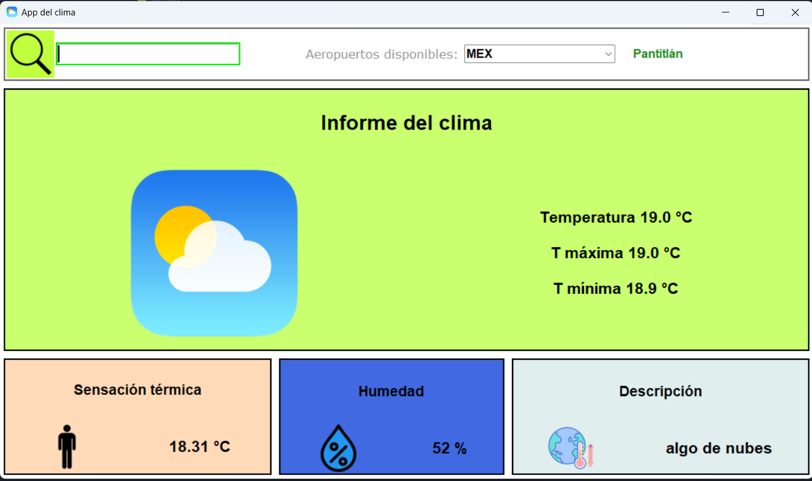

# Proyecto01 - Modelado y Programación:
Proyecto hecho en python que dado un archivo csv obtiene la información climática de ciudades

Link al repositorio del proyecto: https://github.com/AsahelMain/Proyecto01

La revisión se debe hacer sobre la rama main.

El diseño de la interfaz está basado en el código de Magno Efren, cuyo github es: https://github.com/MagnoEfren



## Alumnos:
     1. Main Cerezo Asahel Said 
     2. Reyes López Eduardo Alfonso 

## Prerrequisitos
     1. [Instalar Python](https://www.python.org/downloads) tomando en cuenta el sistema operativo que se tiene 
     2. Instalar la biblioteca [Requests](https://pypi.org/project/requests/) en su sitio web o en su defecto, ejecutar el siguiente comando en la terminal:

           pip install requests 

     3. Contar con una llave en [OpenWeather](https://openweathermap.org)
          a) Registrarse en OpenWeather 
          b) Ir al perfil en la sección de "My API keys"
          c) Copiar la llave que se encontrará debajo de la palabra "Key"

## Instalación
     Clonar el repositorio: https://github.com/AsahelMain/Proyecto01

## Pre-ejecución

Dentro del directorio Proyecto01, en el archivo con nombre "key.csv" pegar su llave del sitio de OpenWeather

## Ejecución

Situarse en el directorio Proyecto01/src:
```bash
    cd ./Proyecto01/src
```
Para ejecutar el proyecto usar el siguiente comando:
```bash
    python3 ./main.py
```

## Ejecución pruebas

Situarse en el directorio Proyecto01 y ejecutar los siguientes comandos según las pruebas deseadas.

Pruebas Aeropuerto (airport.py):
```bash
     python3 tests/TestAirport.py
```

Pruebas lectura de base de datos (readcsv.py):
```bash
     python3 tests/TestReadcsv.py
```

Pruebas Información climática (weatherInfo.py):
```bash
     python3 tests/TestWeatherInfo.py
```

Pruebas Ventana (window.py):
```bash
     python3 tests/TestWindow.py
```

## Bibliotecas usadas
     1. csv      ----> usada para leer el archivo csv con la función reader()
     2. requests ----> usada para hacer la llamada a la API con la función open()
     5. os       ----> usada para acceder a la dirección de archivos
     6. tkinter: Tk, Button, Entry, Label,PhotoImage,Frame ----> usada para la GUI
     7. tkinter.ttk: Combobox ----> usada para la GUI
     8. time     ----> usada en la GUI


